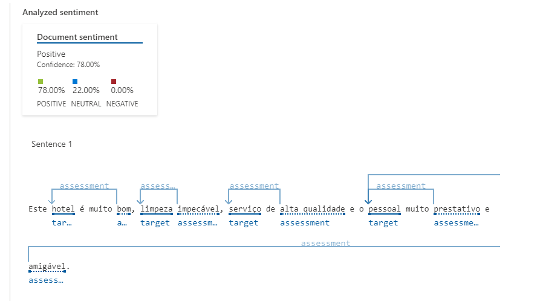
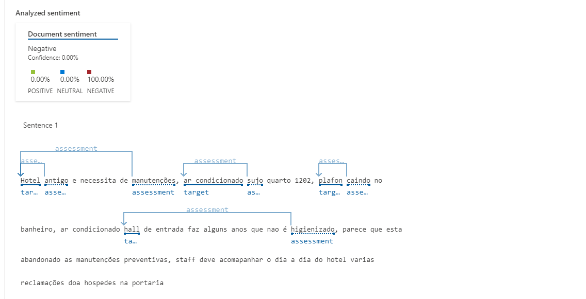
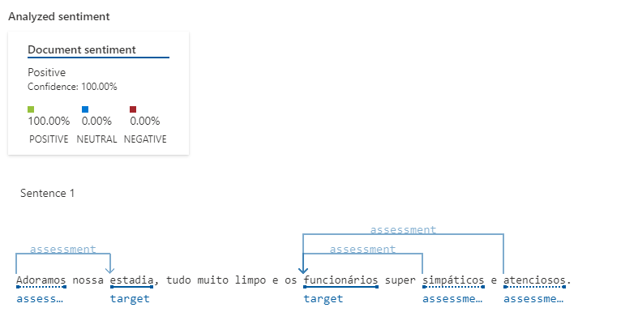

# Análise de texto com o Language Studio

Conforme demonstrado pela instrutora Valéria, a partir de um texto podemos saber como a pessoa estava se sentindo no momento em que o texto foi escrito. 

Utilizando a ferramenta Language Studio ao colar um texto, podemos identificar através das palavras-chave o que aquele texto representa. 

Peguei 3 avaliações de hotéis em uma cidade próxima à minha. Uma boa, uma média e um ruim. 

Tanto a média quanto a boa refletiram no resultado do uso da ferramenta. 

Já a ruim, a pessoa qualificou como 6/10, mas, com resultado, tudo colocado na avaliação, qualificou-a com 100% ruim, mesmo que a nota tenha sido 6. 

Talvez pelo emprego de algumas palavras, a ferramenta entendeu que não seria nem um pouco positiva. 

Seguem as avaliações e seus resultados.

## Avaliação 1

### Resultado 

## Avaliação 2

### Resultado 

## Avaliação 3

### Resultado 

Conclusão: Ferramenta muito precisa com o que realmente quer se passar nas avaliações.